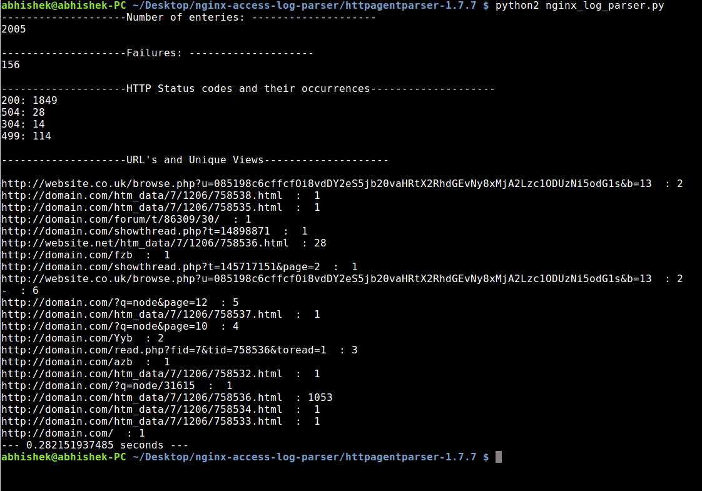

# nginx-access-log-parser
nginx access log parser program analyses logs and produces statistics.
- Number of log entries processed
- Processing failures
- Number Log entries by HTTP status code
- URLs and pageviews
- URLs and unique visitors

Unique visitors:
HTTP requests possessing the same IP, the same date, and the same agent are considered as a unique visit. It includes web crawlers/spiders.

Pageviews:
All requests with HTTP status 200 are counted as pageviews. A important consideration that same path request by same IP and same user agent within N seconds span is counted as one pageview. This N seconds should be configurable.

#### Step 1: Extract httpagentparser-1.7.7.tar.gz
'tar -xvzf httpagentparser-1.7.7.tar.gz'

#### Step 2: Copy nginx_log_parser.py & example.log in extracted httpagentparser-1.7.7 folder

#### Step 3: Run nginx_log_parser.py

*NOTE: The code is written in Python 2.7.*

Output:

